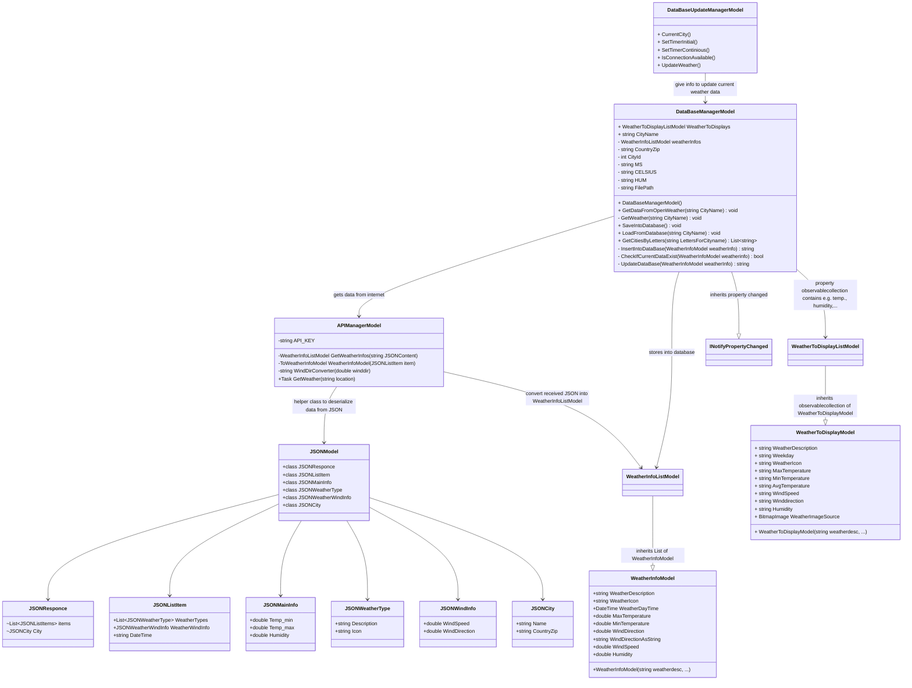

# Mikail

```mermaid
classDiagram

	DataBaseManagerModel --> APIManagerModel : gets data from internet
	
	APIManagerModel --> JSONModel : helper class to deserialize data from JSON
	
	%% This is helper class, which gets the properties, that we need for our application
	JSONModel --> JSONResponce
	JSONModel --> JSONListItem
	JSONModel --> JSONMainInfo
	JSONModel --> JSONWeatherType
	JSONModel --> JSONWindInfo
	JSONModel --> JSONCity	
	
	%% After that, APIManager converts this thata into a List of weatherinfomodel
	APIManagerModel --> WeatherInfoListModel : convert received JSON into WeatherInfoListModel
	
	WeatherInfoListModel --|> WeatherInfoModel : inherits List of WeatherInfoModel
	
	DataBaseUpdateManagerModel --> DataBaseManagerModel : give info to update current weather data
	
	DataBaseManagerModel --> WeatherInfoListModel : stores into database
	
	%% Weather data class, which are going to be displayed 
	WeatherToDisplayListModel --|> WeatherToDisplayModel : inherits observablecollection of WeatherToDisplayModel
	DataBaseManagerModel --> WeatherToDisplayListModel: property observablecollection contains e.g. temp., humidity,...
	DataBaseManagerModel --|> INotifyPropertyChanged: inherits property changed
	
		
    class APIManagerModel{
    -string API_KEY
    -WeatherInfoListModel GetWeatherInfos(string JSONContent)
    -ToWeatherInfoModel WeatherInfoModel(JSONListItem item)
    -string WindDirConverter(double winddir)
    +Task GetWeather(string location)
    }
    class WeatherToDisplayModel{
    + string WeatherDescription
    + string Weekday
    + string WeatherIcon
    + string MaxTemperature
    + string MinTemperature
    + string AvgTemperature
    + string WindSpeed
    + string Winddirection
    + string Humidity
    + BitmapImage WeatherImageSource
    + WeatherToDisplayModel(string weatherdesc, ...)
    }
    class WeatherToDisplayListModel~WeatherToDisplayModel~{
    }
    class DataBaseManagerModel{
    + WeatherToDisplayListModel WeatherToDisplays
    + string CityName
    - WeatherInfoListModel weatherInfos
    - string CountryZip
    - int CityId
    - string MS
    - string CELSIUS
    - string HUM
    - string FilePath
    + DataBaseManagerModel()
    + GetDataFromOpenWeather(string CityName) void
    - GetWeather(string CityName) void
    + SaveIntoDatabase() void
    + LoadFromDatabase(string CityName) void
    + GetCitiesByLetters(string LettersForCityname) List~string~
    - InsertIntoDataBase(WeatherInfoModel weatherInfo) string
    - CheckIfCurrentDataExist(WeatherInfoModel weatherinfo) bool
    - UpdateDataBase(WeatherInfoModel weatherInfo) string
    }
    class DataBaseUpdateManagerModel{
    + CurrentCity()
    + SetTimerInitial()
    + SetTimerContinious()
    + IsConnectionAvailable()
    + UpdateWeather()
    }
    class JSONModel{
    +class JSONResponce
    +class JSONListItem
    +class JSONMainInfo
    +class JSONWeatherType
    +class JSONWeatherWindInfo
    +class JSONCity
    }
    class JSONResponce {
    	~List~JSONListItems~ items
    	~JSONCity City
    }
    class JSONListItem {
        +List~JSONWeatherType~ WeatherTypes
    	+JSONWeatherWindInfo WeatherWindInfo
    	+string DateTime
    }
    class JSONMainInfo {
       	+double Temp_min
       	+double Temp_max
       	+double Humidity
    }
    class JSONWeatherType {
    	+string Description
    	+string Icon
    }
    class JSONWindInfo {
    	+double WindSpeed
    	+double WindDirection
    }
    class JSONCity {
    	+string Name
    	+string CountryZip
    }
    
    class WeatherInfoModel{
        +string WeatherDescription
    	+string WeatherIcon
    	+DateTime WeatherDayTime
    	+double MaxTemperature
    	+double MinTemperature
    	+double WindDirection
    	+string WindDirectionAsString
    	+double WindSpeed
    	+double Humidity
    	+WeatherInfoModel(string weatherdesc, ...)
    }
    class WeatherInfoListModel~WeatherInfoModel~{
    }
```