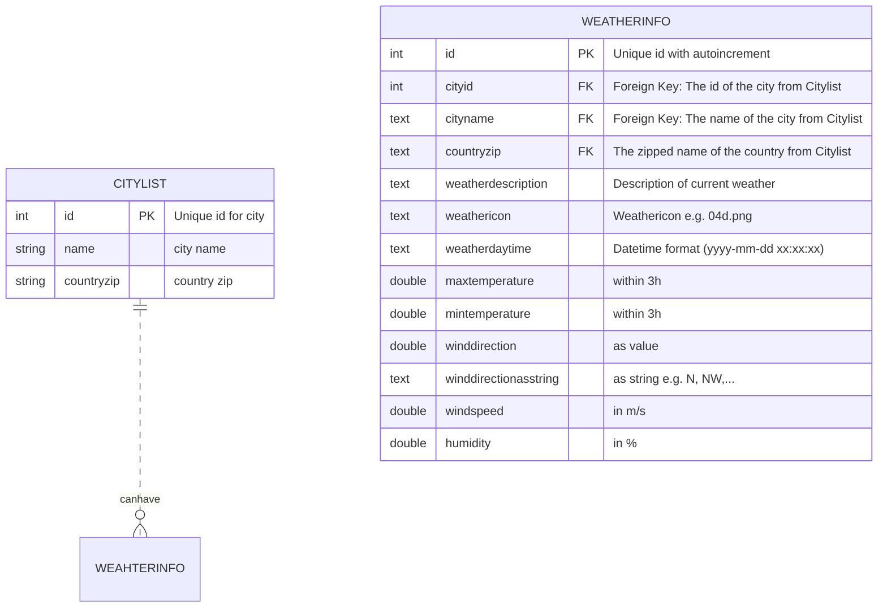

# Data-Structure:

```mermaid
 erDiagram
 	   CITYLIST ||..o{ WEAHTERINFO : canhave
 	   CITYLIST{
 	   int id PK "Unique id for city"
 	   string name "city name"
 	   string countryzip "country zip"
 	   }
       WEATHERINFO { 
       		int id PK "Unique id with autoincrement"
       		int cityid FK "Foreign Key: The id of the city from Citylist"
       		text cityname FK "Foreign Key: The name of the city from Citylist"
            text countryzip FK "The zipped name of the country from Citylist"
            text weatherdescription "Description of current weather"
            text weathericon "Weathericon e.g. 04d.png"
            text weatherdaytime "Datetime format (yyyy-mm-dd xx:xx:xx)"
            double maxtemperature "within 3h"
            double mintemperature "within 3h"
            double winddirection "as value"
            text winddirectionasstring "as string e.g. N, NW,..."
            double windspeed "in m/s"
            double humidity "in %"       		
       }
```

Each city can have 0 or more forecasts. Average/min./max. temperature is going to be received by database.
