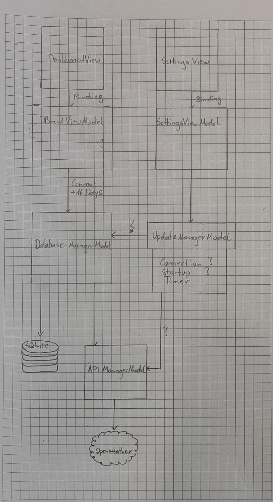

[TOC]

#  Einleitung
Im Sinne des FSST Wahlpflichtfaches soll eine Gruppenarbeit im Ramen einer Desktop-Applikation erstellt werden.

In dieser Projektarbeit handelt es sich um ein sogenanntes "Widget", dies ist ein Desktop-Zubehör, welches ein sehr einfaches User Interface besitzt und unter allen anderen Anwendungen und Desktop Icons angezeigt wird.

# Allgemeines

## Auftrag
Hierbei wird ein "Wetter Widget" erstellt, welches das derzeitige Wetter und die Prognosen anzeigt. Die Wochen-Prognosen werden lokal zur offline-Nutzung in einer Datenbank abgespeichert. Die Wetterdaten werden per API geliefert und das User-Interface wird mit MVVM in WPF umgesetzt.

Durch ein Unterformular kann der derzeitige Standort ausgewählt werden

## Bereits bestehende Systeme oder Produkte
 - [Icons](https://openweathermap.org/weather-conditions#Weather-Condition-Codes-2)
 - [JSON Converter](https://github.com/kerminator-dev/WeatherWidget/blob/main/src/WeatherWidget/WeatherWidget/Models/JSON/OpenWeatherJSON.cs)
 - [Inspiration](https://github.com/kerminator-dev/WeatherWidget)

## Teams und Schnittstellen
Team-Mitglieder:

- Mikail Yölek
- Tim Kicker

Speicher:

- GitLab
- GitHub (Mirror)

Schnittstellen:
- API
- Datenbank
Nachdem die Daten aus dem Internet geholt wurden, werden dies in einer Datenbank abgespeichert und von dort aus abgerufen.

## Abkürzungen
| Abkürzung | Bedeutung            |
| --------- | -------------------- |
| `MVVM`    | Model-View-ViewModel |
| Branch    | Arbeitszweig in Git  |

## Rahmenbedingungen
Hierbei werden Anfangs im GitLab Repo mehrere Tickets erstellt, welche einem Team-Mitglied zugeteilt werden. Anschließend erstellt das zugeteilte Team-Mitglied einen entsprechenden Branch für das Ticket. Bei Vervollständigung des Tickets wird der Branch in den Main-Branch gemerged.

# Technische Anforderungen
- IDE 
  - VS 2019 / 2022
- Nuget-Packages
  - SQL Package
- API
  - OpenWeather API

# Problemanalyse
- [ ] UI nicht auf Icon-Ebene anzeigbar
  - Mögliche Lösung: Applikation unter allen Fenstern anzeigen, um dem Nutzer somit das Gefühl zu geben, als wäre es auf der gleichen Ebene

#  Qualität
- Widget
  - Applikation soll nicht in Taskbar angezeigt werden
  - Applikation soll sich unter allen anderen Fenstern befinden
  - Der User soll das Gefühl bekommen, dass sich die Applikation auf direkter Ebene mit den Desktop-Icons befindet.
- Einhaltung des MVVM 
  - Keine direkte Abhängigkeit -> Wird in Anforderung genauer beschrieben

#  Anforderungen
Funktionale Anforderungen sind gewünschte Funktionalitäten oder Verhalten eines Systems bzw. Produkts. Sie beschreiben, was das zu entwickelnde Produkt tun oder können soll. Nichtfunktionale Anforderungen betreffen z.B. das Design und die user experience (UX).
## Anforderung 1 : MVVM

Das gesamte Projekt sollte dem MVVM System entsprechen. D.H. Es müssen alle Elemente der Applikation "lose" miteinander verknüpft werden. Es darf sich beispielsweise kein Element der UI-Ebene (View) direkt auf ein Klasse im Hintergrund (Model) beziehen. Dazwischen sollte immer ein passendes ViewModel stehen. Auch sollen alle Aufträge welche im UI durch den User ausgelöst werden, mit Hilfe von Commands durchgeführt werden.

## Anforderung 2 : API-Abruf

Die Wetterdaten sollen automatisch bei Online-Nutzung der Applikation mit Hilfe der API heruntergeladen werden

## Anforderung 3 : Offline Nutzung

Die Applikation soll komplett offline Nutzbar sein. D.H. dass Die Daten der API in die lokale Datenbank gespeichert werden und diese (im Offline Modus) wieder aus der Datenbank gelesen werden können

# Projektentwicklung

## Konzept
Wetterbericht: 5 Tage, statt 16 Tage (falsch in Abbildung):

## Aufteilung
| Open                      | In Progress                    | Closed  | \|   | All                                        | Member |
| ------------------------- | ------------------------------ | ------- | ---- | ------------------------------------------ | ------ |
| ViewModels                | API-Manager, Model Weatherinfo | API-Key | \|   | API-Key                                    | Mikail |
| (Database-Update-Manager) | basic MVVM structure           |         | \|   | API-Manager,Model Weatherinfo              | Mikail |
| Database-Manager          |                                |         | \|   | ViewModels                                 | Tim    |
|                           |                                |         | \|   | basic MVVM structure                       | Tim    |
|                           |                                |         | \|   | Database-Manager (Database-Update-Manager) | Mikail |

- API-Manager:
  - API-Manager soll die Daten aus dem Internet holen und in WeatherModel deserializieren und in eine Liste abspeichern
- Database-Manager:
  - Database-Manager soll alle Daten, die Wetterinformationen angeht, in die Datenbank speichern, lesen, verändern und löschen.
  - Database-Update-Manager/Update-Manager geplant ist eine Klasse, welche "Signale" an Database-Manager übermittelt, um Daten aus Datenbank zu holen.

## Logbücher (Referenzen)
### Tim
[Log-Buch Tim](./LogBookTim.md)
### Mikail
[Log-Buch Mikail](./LogBookMikail.md)

>Hier soll als erstes auch die grundsätzliche Struktur der Anwendung beschrieben werden. Welche Art von Anwendung (z.B. Konsolen- oder WPF-Anwendung)? Wie ist die Anwendung strukturiert (z.B. Frontend und Library)? Welche Klassen sind zu erwarten, welches Klassendesign?
>
>Beschreiben Sie genau, wann, was passiert und wie das gesamte Projekt organisiert ist. Hier ist Das Projekt in kleinere Aufgabenbereiche einzuteilen, diese exakt zu beschreiben, der notwendige Arbeitsaufwand zu schätzen **und** zu protokollieren. Dazu können sogenannte Tickets dienen.
>
>Ein solches Ticket kann z.B. eine einzelne Anforderung beschreiben. Dazu wird ein Titel und die Beschreibung der Anforderung, aber auch Vorschläge für die Umsetzung notiert.
>
>**Tipp:** Für die Umsetzung des Projektes empfiehlt es sich, die Tickets (z.B. als A6 Zettel) in 3 Spalten zu gliedern: **open** <-> **in progress** <-> **done**
>Anfangs sind alle Tickets in der Spalte open, bei Projektabschluss sind alle Tickets in done.

# Quellen

- Pfilchtenheft Abwandlung durch H. Rusch - HTL Rankweil: https://www.ionos.at/digitalguide/websites/web-entwicklung/pflichtenheft/
