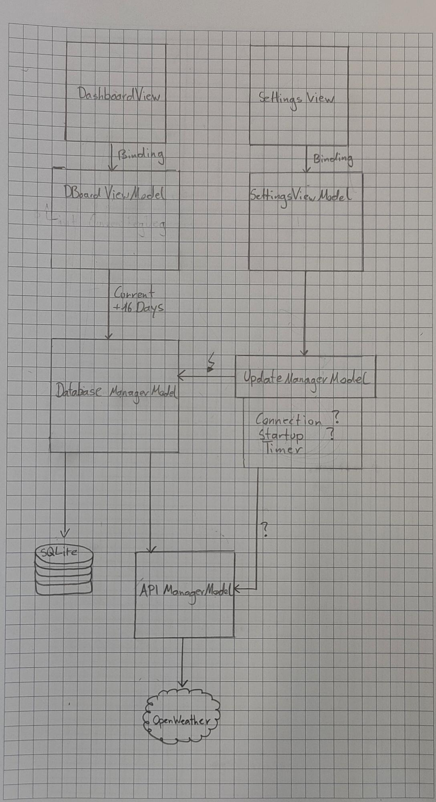
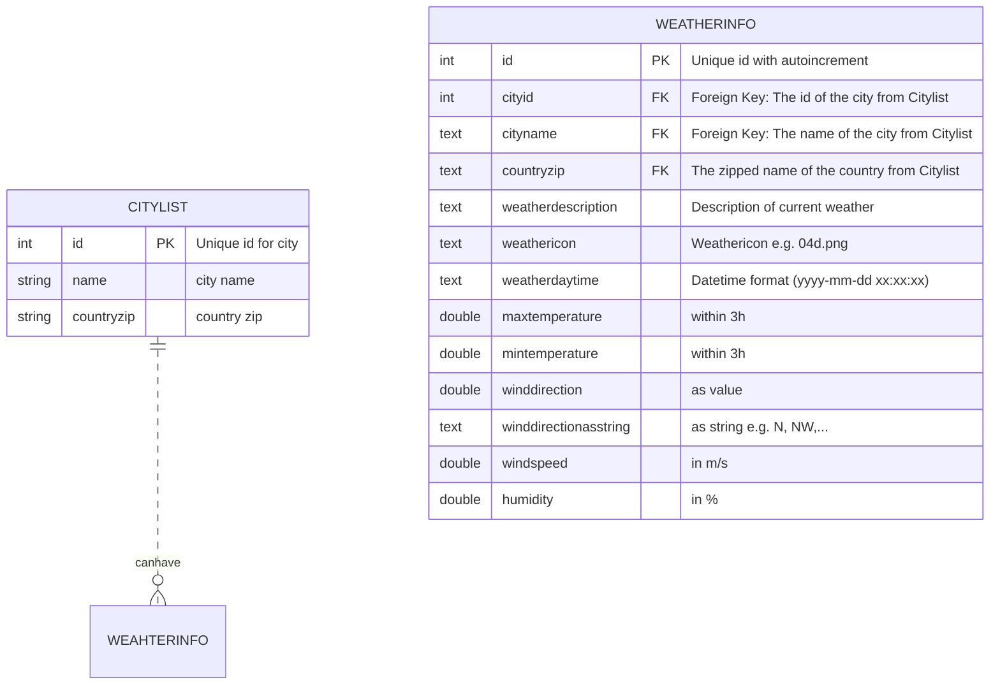

<h1>Weather-Widget</h1>

[TOC]

# Allgemeines

## Auftrag

Hierbei wird ein "Wetter Widget" erstellt, welches das derzeitige Wetter und die Prognosen anzeigt. Die Wochen-Prognosen werden lokal zur offline-Nutzung in einer Datenbank abgespeichert. Die Wetterdaten werden per API geliefert und das User-Interface wird mit MVVM in WPF umgesetzt.

Durch ein Unterformular kann der derzeitige Standort ausgewählt werden

## Projektmitarbeiter

| Name         | Tätigkeiten                         |
| ------------ | ----------------------------------- |
| Tim Kicker   | GUI, Bindings, MVVM                 |
| Mikail Yölek | Datenmanagement, Datenbank (SQLite) |

## Speicher

- Gitlab
- GitHub (Mirror)

## Schnittstellen

- API
- Datenbank (SQLite)

## Abkürzungen

| Abkürzung | Bedeutung            |
| --------- | -------------------- |
| `MVVM`    | Model-View-ViewModel |
| Branch    | Arbeitszweig in Git  |
| DB 		 |Datenbank|

## Rahmenbedingungen

Hierbei werden Anfangs im GitLab Repo mehrere Tickets erstellt, welche einem Team-Mitglied zugeteilt werden. Anschließend erstellt das zugeteilte Team-Mitglied einen entsprechenden Branch für das Ticket. Bei Vervollständigung des Tickets wird der Branch in den Main-Branch gemerged.

## Theoretische Grundlagen

- notwendige Kenntnisse:
  - DB
  - API
    - JSON
  - MVVM (z.B. Bindings)
  - C#

## Kurze Projektbeschreibung

Ziel dieses Projektes ist, ein Widget zu erstellen, welches die Wetterdaten für die eingegebene Ortschaft aus dem Internet holt und diese grafisch (mittels Symbolen, Temperaturen, ...) darstellt.

##  Qualität
- Widget
  - Applikation soll nicht in Taskbar angezeigt werden
  - Applikation soll sich unter allen anderen Fenstern befinden
  - Der User soll das Gefühl bekommen, dass sich die Applikation auf direkter Ebene mit den Desktop-Icons befindet.
- Einhaltung des MVVM 
  - Keine direkte Abhängigkeit -> Wird in Anforderung genauer beschrieben

# Technische Anforderungen
- IDE 
  - VS 2019 / 2022
- Nuget-Packages
  - SQL Package
- API
  - OpenWeather API

#  Anforderungen
## Anforderung 1 : MVVM

Das gesamte Projekt sollte dem MVVM System entsprechen. D.H. Es müssen alle Elemente der Applikation "lose" miteinander verknüpft werden. Es darf sich beispielsweise kein Element der UI-Ebene (View) direkt auf ein Klasse im Hintergrund (Model) beziehen. Dazwischen sollte immer ein passendes ViewModel stehen. Auch sollen alle Aufträge welche im UI durch den User ausgelöst werden, mit Hilfe von Commands durchgeführt werden.

## Anforderung 2 : API-Abruf

Die Wetterdaten sollen automatisch bei Online-Nutzung der Applikation mit Hilfe der API heruntergeladen werden

## Anforderung 3 : Offline Nutzung

Die Applikation soll komplett offline Nutzbar sein. D.H. dass Die Daten der API in die lokale Datenbank gespeichert werden und diese (im Offline Modus) wieder aus der Datenbank gelesen werden können

# Projektentwicklung

## Konzept
Wetterbericht: 5 Tage, statt 16 Tage (falsch in Abbildung):


## Aufteilung
| All                                        | Member       |
| ------------------------------------------ | ------------ |
| API-Key                                    | Mikail       |
| API-Manager,Model Weatherinfo              | Mikail       |
| ViewModels                                 | Tim          |
| basic MVVM structure                       | Tim          |
| Database-Manager (Database-Update-Manager) | Mikail / Tim |

- API-Manager:
  - API-Manager soll die Daten aus dem Internet holen und in WeatherModel deserializieren und in eine Liste abspeichern
- Database-Manager:
  - Database-Manager soll alle Daten, die Wetterinformationen angeht, in die Datenbank speichern, lesen, verändern und löschen.
  - Database-Update-Manager/Update-Manager geplant ist eine Klasse, welche "Signale" an Database-Manager übermittelt, um Daten aus Datenbank zu holen.

## Logbücher
### Tim: Log

##### 13-04-2022 

- [MVVM] MainWindow
  - Setup Bindings (CurrentViewModel <-> CurrentView)
- [MVVM / GUI] Views
  - DashboardView: Display weather information
  - SettingsView: Edit location
- [MVVM] ViewModels
  - DashboardViewModel: Manage binding between View and API/Database
  - SettingsViewModel: Manage location setting for API
  - BaseViewModel: Base class to inherit from -> update on changed


##### 16-04-2022

- [MVVM] Navigationstore
  - Implement current viewmodel
  - Method for changing viewmodel
- [MVVM] Commands
  - CommandBase: Base class to inherit from -> implements ICommand Interface
  - ExitApplicationCommand : Terminate application and calls any cancellationtokens
  - NavigateCommand : Navigate to choosen viewmodel


##### 22-04-2022

- [MVVM] Starup (App.xaml.cs)+
  - Add NavigationStore
  - DashBoardViewModel on startup
  - Set up MainWindow
  - Methods for creating ViewModels

##### 29-04-2022

- [GUI] DashboardView
  - Fix alligment (current weather)
  - implement listview for weather-forecast

##### 30-04-2022

- [GUI] Allign lociation text (settings)
- [MVVM] Adding comments


##### 05-05-2022

- [General] fixed duplicate window bug
- [GUI] replaced ListView with ListBox

##### 06-05-2022

- [GUI] UI Overhaul
  - Removed Info, Wind, etc.
  - Added headers
  - Realligned items
  - Removed button background color on mouse hover

##### 13-05-2022

- [API/Database] create update manager
  - update on startup
  - update every 3h (timer)
- [GUI / MVVM] update manager binding
  - pass updatemanager into ViewModels
  - bind settingsviewmodel
  - create command to call update method on confirm-button press

##### 14-05-2022

- [API / Database] check connection to api before request

##### 18-05-2022

- [Database] Database Update manager update every 3hours
- [GUI] fix image binding
- [API] imported api key
- [UI] Show "X" Value if List is empty

##### 20-05-2022

- [API/Database] Update on HH:10 via Timer
- [MVVM] Automate binding update via event on weather collection changed

##### 21-05-2022

- [UI] UI Overhaul
  - Backgroud color
  - Rearrange elements
  - Show icons in forecast
- [BUG] Bugfixing
  - fix showing icon
  - fix crash on HH:10

### Mikail: Log

##### 08-04-2022 - Friday

- [Organizational] organising project folder/files/ ... on gitlab
- [Organizational] https://openweathermap.org/weather-conditions#Weather-Condition-Codes-2 ... Icons for different weather

##### 13-04-2022 - Wednesday (Easter Holidays)

- [Python Script] Installed Pycharm -> Convert Cities (JSON-File) to SQLite-File -> Try to req.
- [Python Script] Converting into SQLite-File --> \2h

##### 14-04-2022 - Thursday (Easter Holidays)

- [WeatherInfoModel] Model for weather information `weatherInfoModel `--> \1/2h
- [API-Manager] Start with `API-Manager` --> \1/2h

##### 15-04-2022 - Friday (Easter Holidays --> nothing on this day)

##### 22-04-2022 - Friday

- [JSONModel] JSON Converter --> https://github.com/kerminator-dev/WeatherWidget/blob/main/src/WeatherWidget/WeatherWidget/Models/JSON/OpenWeatherJSON.cs change code to my needs \2h
- [WeatherInfoListModel] Model for weather information `weatherInfoListModel`
- TO DO: Pflichtenheft, UI-Entwürfe, Aufteilung Arbeitspakete, Klassendiagramme, ER-Diagramme


till 02.05 --> per E-Mail

##### 23-04-2022 - Saturday

- [API-Manager, JSONModel] Working on API-Manager, JSON-Converter

##### 29-04-2022 - Friday

- [Organizational] finishing `Pflichtenheft.md`, documentation `LogBookMikail.md` --> \2h
- [WeatherInfoModel] update on `WeatherInfoModel` --> \1/4h (String for wind direction)

##### 30-04-2022 - Saturday

- [Organisation] documentation: ER-Diagram, Class-Diagram --> \2h
- [API-Manager] work on exceptions for different errors --> \2h
  - Try and Catch
- [DataBaseManager] new Branch, new Class -->\1/4h
  - [DataBaseManager] Save into DataBase (try, not final) --> \1,5h

##### 06-05-2022 - Friday

- [DataBaseManager]
  - first steps for CRUD (Remove, Insert, Update, ...) --> \2h

##### 08-05-2022 - Saturday

- Merged DataBase (citylist and weatherinfo) together --> \ 1/2h

##### 12-05-2022 - Thursday

- [DataBaseManager]
  - got MIN, MAX, AVERAGE, MOST FREQUENT weather--> \ 2 h

##### 13-05-2022 - Friday

- ill (visiting the doctor) --> 1h
- [Organizational] asked a few questions about the project --> \1/2h
- [DataBase] deleted duplicate cities --> \1/2h
- [DataBaseManagerModel] changed FOREIGN KEYS --> \1/2h

#####  14-05-2022 - Saturday

- new Classes [WeatherToDisplayListModel, WeatherToDisplayModel] --> 1/2h
  - is going to be binded by UI

- [DataBaseManagerModel] UPDATE and INSERT INTO --> \2 1/2h
  - Add new values and update present values
    - check if exits -> update
    - if not --> insert

  - Added new feature for receiving a list of cities, which starts with specific letters


##### 20-05-2022 - Friday

- normal lesson --> \0h

##### 21-05-2022 - Saturday

- [DataBaseManagerModel] Load,  Code improvements
  - Load data from DB --> \4h
  - prettied some code --> \1/2h
- [WeatherToDisplayList] save loaded data into this list --> \1/2h
- [WeatherToDisplay] added windspeed (forgotten to add it)
- [main] merged
- [Organizational] documentation --> \1/2h
- [Bugfix] Icons on UI, Location problems --> \1/2h

##### 22-05-2022 - Sunday

- [Organizational] documentation -->\1/2h
  - [UPDATE] Class diagrams
  - [UPDATE] ER diagram

### Siehe auch:

[Log-Buch Tim](./LogBookTim.md)

[Log-Buch Mikail](./LogBookMikail.md)

# Umsetzung

Hier kommt eine graphische Darstellung und/oder verbale Erklärung, wie die Anwendung aufgebaut ist. Mögliche Darstellungen sind Fluss- bzw. Aktivitätsdiagramme, Klassendiagramme, Use Case Diagramme, Statemachines, etc. Die folgenden Überschriften sind exemplarisch gedacht

## UI

Das UI besteht aus zwei Menüs. Ein Menü dient dazu, die aus dem Internet geholten Daten grafisch darzustellen:


Das zweite Menü dient dazu, die jeweilige Ortschaft einzugeben. Als Standardwert ist Rankweil eingetragen:


## Klassendiagramme
````mermaid
classDiagram
	DataBaseManagerModel --> APIManagerModel : gets data from internet
	
	APIManagerModel --> JSONModel : helper class to deserialize data from JSON
	
	%% This is helper class, which gets the properties, that we need for our application
	JSONModel --> JSONResponce
	JSONModel --> JSONListItem
	JSONModel --> JSONMainInfo
	JSONModel --> JSONWeatherType
	JSONModel --> JSONWindInfo
	JSONModel --> JSONCity	
	
	%% After that, APIManager converts this thata into a List of weatherinfomodel
	APIManagerModel --> WeatherInfoListModel : convert received JSON into WeatherInfoListModel
	
	WeatherInfoListModel --|> WeatherInfoModel : inherits List of WeatherInfoModel
	
	DataBaseUpdateManagerModel --> DataBaseManagerModel : give info to update current weather data
	
	DataBaseManagerModel --> WeatherInfoListModel : stores into database
	
	%% Weather data class, which are going to be displayed 
	WeatherToDisplayListModel --|> WeatherToDisplayModel : inherits observablecollection of WeatherToDisplayModel
	DataBaseManagerModel --> WeatherToDisplayListModel: property observablecollection contains e.g. temp., humidity,...
	DataBaseManagerModel --|> INotifyPropertyChanged: inherits property changed
	
		
    class APIManagerModel{
    -string API_KEY
    -WeatherInfoListModel GetWeatherInfos(string JSONContent)
    -ToWeatherInfoModel WeatherInfoModel(JSONListItem item)
    -string WindDirConverter(double winddir)
    +Task GetWeather(string location)
    }
    class WeatherToDisplayModel{
    + string WeatherDescription
    + string Weekday
    + string WeatherIcon
    + string MaxTemperature
    + string MinTemperature
    + string AvgTemperature
    + string WindSpeed
    + string Winddirection
    + string Humidity
    + BitmapImage WeatherImageSource
    + WeatherToDisplayModel(string weatherdesc, ...)
    }
    class WeatherToDisplayListModel~WeatherToDisplayModel~{
    }
    class DataBaseManagerModel{
    + WeatherToDisplayListModel WeatherToDisplays
    + string CityName
    - WeatherInfoListModel weatherInfos
    - string CountryZip
    - int CityId
    - string MS
    - string CELSIUS
    - string HUM
    - string FilePath
    + DataBaseManagerModel()
    + GetDataFromOpenWeather(string CityName) void
    - GetWeather(string CityName) void
    + SaveIntoDatabase() void
    + LoadFromDatabase(string CityName) void
    + GetCitiesByLetters(string LettersForCityname) List~string~
    - InsertIntoDataBase(WeatherInfoModel weatherInfo) string
    - CheckIfCurrentDataExist(WeatherInfoModel weatherinfo) bool
    - UpdateDataBase(WeatherInfoModel weatherInfo) string
    }
    class JSONModel{
    +class JSONResponce
    +class JSONListItem
    +class JSONMainInfo
    +class JSONWeatherType
    +class JSONWeatherWindInfo
    +class JSONCity
    }
    class JSONResponce {
    	~List~JSONListItems~ items
    	~JSONCity City
    }
    class JSONListItem {
        +List~JSONWeatherType~ WeatherTypes
    	+JSONWeatherWindInfo WeatherWindInfo
    	+string DateTime
    }
    class JSONMainInfo {
       	+double Temp_min
       	+double Temp_max
       	+double Humidity
    }
    class JSONWeatherType {
    	+string Description
    	+string Icon
    }
    class JSONWindInfo {
    	+double WindSpeed
    	+double WindDirection
    }
    class JSONCity {
    	+string Name
    	+string CountryZip
    }
    
    class WeatherInfoModel{
        +string WeatherDescription
    	+string WeatherIcon
    	+DateTime WeatherDayTime
    	+double MaxTemperature
    	+double MinTemperature
    	+double WindDirection
    	+string WindDirectionAsString
    	+double WindSpeed
    	+double Humidity
    	+WeatherInfoModel(string weatherdesc, ...)
    }
    class WeatherInfoListModel~WeatherInfoModel~{
    }
    class DataBaseUpdateManagerModel{
    + CurrentCity()
    + SetTimerInitial()
    + SetTimerContinious()
    + IsConnectionAvailable()
    + UpdateWeather()
    }
class ViewModelBase{
	Event PropertyChanged
	OnPropertyChanged()
}
class SettingsViewModel{
	Command BackToDashboardButton
	Command CloseButtonCommand
	string CurrentLocation
}
class MainViewModel{
	Navigationstore _navigationStore
	OnCurrentViewModelChanged()
	ViewModelBase CurrentViewModel
}
class DashBoardViewModel{
	string CurrentDate
	string CurrentDay
	string CurrentLocation
	string CurrentType
	WeatherInfoListModel ForeCastList
}
class DashBoardView
class SettingsView
class CommandBase{
	EventHandler CanExecuteChanged
	CanExecute(object)
	OnCanExecutedChanged()
	Execute(object)
}
class ExitApplicationCommand{
	Execute()
}
class UpdateCityCommand
class NavigateCommand{
	NavigationStore _navigationStore
	Func<ViewModelBase> _createViewModel
	NavigateCommand(NavigationStore Func<ViewModelBase> )
}
class MainWindowXaml{
	
}
class NavigationStore{
	ViewModelBase CurrentViewModel
	Action CurrentViewModelChanged
	OnCurrentViewModelChanged()
}
class AppXamlCs{
	NavigationStore _navStore;
	OnStartup(StartupEventArgs)
	CreateDashboardViewModel()
	CreateSettingsViewModel()
}

ViewModelBase ..> SettingsViewModel : inherit
ViewModelBase ..> DashBoardViewModel : inherit
ViewModelBase ..> MainViewModel : inherit
CommandBase ..> ExitApplicationCommand : inherit
CommandBase ..> NavigateCommand : inherit
NavigateCommand <|-- DashBoardViewModel
ExitApplicationCommand <|-- DashBoardViewModel
NavigateCommand <|-- SettingsViewModel
ExitApplicationCommand <|-- SettingsViewModel
UpdateCityCommand <|-- SettingsViewModel
NavigationStore <|-- AppXamlCs
NavigationStore <|-- MainWindowXaml
SettingsView <|-- MainWindowXaml
DashBoardView <|-- MainWindowXaml
MainViewModel <|-- MainWindowXaml
DashBoardViewModel *-- DashBoardView : binding
SettingsViewModel *-- SettingsView : binding
MainWindowXaml <|-- AppXamlCs
NavigationStore <|-- NavigateCommand
DataBaseUpdateManagerModel <|-- DashBoardViewModel
DataBaseUpdateManagerModel <|-- SettingsViewModel
WeatherToDisplayListModel <|-- DashBoardViewModel
WeatherToDisplayListModel <|-- SettingsViewModel
````

## ER-Diagramm



# Testläufe

- Test #1:
  - Warten bis der Timer 1h vorbei ist (z.B. 20:10, 21:10, ...)
- Test #2:
  - Ortschaft ändern und schauen ob UI sich ändert

## Test #1

### Erwartetes Ergebnis

Die Daten sollten aus dem Internet geholt , anschließend in Datenbank abgespeichert und auf UI aktualisiert werden


### Tatsächliches Ergebnis

Exception: Thread


**TO DO:** Hierbei ist der Fehler, dass von einem anderen Thread auf Daten auf anderem Thread zugegriffen wird. Dies löst eine Fehlermeldung aus. 

## Test #2

### Erwartetes Ergebnis

Ortschaft wird von Rankweil auf Übersaxen umgeändert (Daten von Übersaxen sind noch nicht in der Datenbank vorhanden)


### Tatsächliches Ergebnis

Nachdem man mit Confirm die Ortschaft bestätigt hat, sollte sich das UI auch aktualisieren:


Jedoch ist hier ein Fehler: das UI wird nicht aktualisiert, da die Daten noch nicht in der Datenbank vorhanden sind aber diese schon geladen werden (die Daten werden ASYNCHRON aus dem Internet geholt, JEDOCH ist das Laden der Daten synchron --> Fehler)


**TO DO:** Nachdem man mit Confirm ein 2tes mal die Ortschaft bestätigt wird diese richtig geladen --> Daten erst dann laden, wenn die Daten schon in der Datenbank gespeichert worden sind!!!

## Benutzungsanleitung

Die Solution starten und unser Wetter-Widget genießen : )

- Home:  hier wird das Wetterbericht dargestellt
- Settings: hier kann man den Ort ändern
- Close:  hiermit kann man das Widget schließen

## TO DOs

- Thread Probleme: siehe Test #1
- Laden der Daten: siehe Test # 2
- Das Fenster ist nicht verschiebbar (da kein Rahmen vorhanden ist) --> verschiebbar machen
